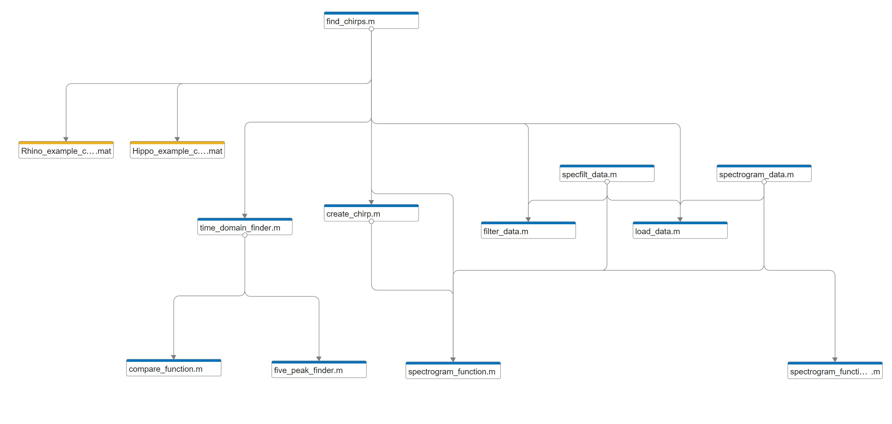

# Chirp Detection Algorithm
This is a repository for chirp detection algorithm development.

## Matlab Libraries
This is the initial MATLAB code that is used to prototype the initial algorithm. The find_chirps function is the main detection function that is used within the algorithm. There are a number of different functions that support this main function. Those functions are shown below in the following dependency tree.

